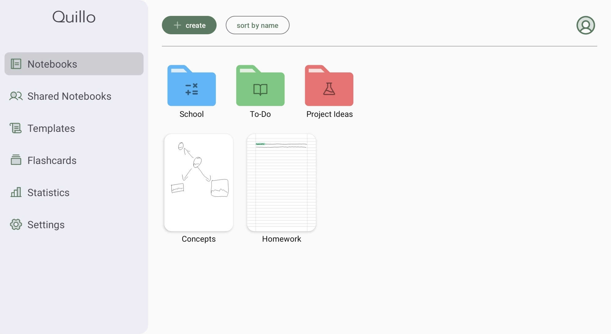
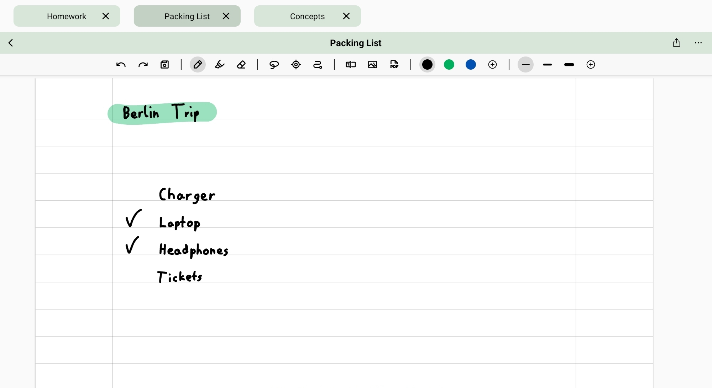

# Quillo

Hey👋 Thank you for your interest in Quillo!

Quillo is a handwriting notes app for Android, developed to provide a smooth handwriting experience. The core features of the app — such as writing, syncing and organizing your notes — already work well. However, the app is still under active development, so some features aren't implemented yet (such as exporting single pages instead of the entire notebook). To create a fully functional app, I need help. If you'd like to contribute, even if it's just a small improvement, you're more than welcome!


## 🛠️ Features

Quillo provides you with multiple tools, such as a pencil, a highlighter, a laser, a lasso and a path tool.

You can use the laser to present your notes, move parts around with the lasso and draw smooth paths with the path tool.

If you have some documents, you can import them into your notes — whether they're digital (like PDFs) or analog and scanned with the built-in scanner. If you want to share a note, you can export it as a PDF.

If you often lose your notes, this is for you! With Quillo, you can sync your notes with Dropbox for free, so that you won't lose any notes anymore. Even if you don't have access to your device right now, you can view all your notes on any other device, too!

To organize your notes, you can create folders and customize their colors and add expressive icons.

Multitasking is also no problem with Quillo. You can easily open multiple notes and switch between them without any delay, so you can stay productive and well-structured — even if you have a lot of work.

Your notebooks are also flexible. With the integrated page sorter, you can easily rearrange your pages, delete them or add new ones.


## 🖼️ Screenshots





## 🛫 Getting Started

### Build and run the app

#### 1. Clone the repository
```
git clone https://github.com/ByteSculptor07/QuilloNotes.git
```

#### 2. Open the project in Android Studio.

#### 3. Build and run it on your device or emulator

<br>

> [!NOTE]  
> For security reasons, the Dropbox App Key is not included in the source code. You'll need to create your own.

### Enable Dropbox sync

To sync your notes using Dropbox, you need to obtain a Dropbox API Key.

#### 1. [Create a new app](https://www.dropbox.com/developers/apps/create?_tk=pilot_lp&_ad=ctabtn1&_camp=create) on the Dropbox app console

#### 2. Enter information
* Choose "Scoped access"
* Choose "App folder"
* Enter "Quillo" as the app name
* Click "Create app"

#### 3. Set Permissions
* Go to the "Permissions"-tab
* Choose "files.metadata.write" and "files.metadata.read"
* Choose "files.content.write" and "files.content.read"
* Click "Submit"

#### 4. Copy the App key

#### 5. Set API key in the app
* In ```welcomeActivity.java```, line 21, replace ```<your-app-key>``` with your key
* In ```AndroidManifest.xml```, line 51, replace ```"db-<your-app-key>"``` with your key. Make sure you keep the "db-" prefix. 

> [!WARNING]  
> Do **NOT** commit your API Key to the repository.


## 🤝 Contribution

Firstly, thank you for your interest in contributing to this project!

As you may have noticed, the app is far from finished. Many features aren't implemented yet or just incomplete. Not to mention the bugs... So I really need your help. It doesn't matter whether you contribute a lot or if you just fix a typo. Every help is appreciated.

> [!NOTE]  
> Some features aren't implemented yet, but visible in the UI (e.g. buttons). If you'd like to help, check out the [issues](https://github.com/ByteSculptor07/QuilloNotes/issues).


## 📜 License

This project is licensed under the MIT License — see the [LICENSE](https://github.com/ByteSculptor07/QuilloNotes/blob/main/LICENSE) file for details.


## 🙏 Credits

Quillo wouldn't be possible without these awesome open source libraries and tools:

- [ZoomLayout](https://github.com/natario1/ZoomLayout) by Otaliastudios – for smooth zoom and pan support
- [ColorPickerView](https://github.com/skydoves/ColorPickerView) by skydoves – for color selection
- [Glide](https://github.com/bumptech/glide) – for efficient image loading and caching
- [PDFBox for Android](https://github.com/TomRoush/PdfBox-Android) – for PDF rendering and export
- [Gson](https://github.com/google/gson) – for JSON serialization
- [OkHttp](https://square.github.io/okhttp/) – for networking
- [Dropbox SDK](https://github.com/dropbox/dropbox-sdk-java) – for cloud sync
- [DocumentScanner by WebsiteBeaver](https://github.com/WebsiteBeaver/android-document-scanner) – for built-in document scanning


Many thanks to all library authors! 💙

Also, special thanks to [Phosphor Icons](https://phosphoricons.com/) for the awesome icons!
